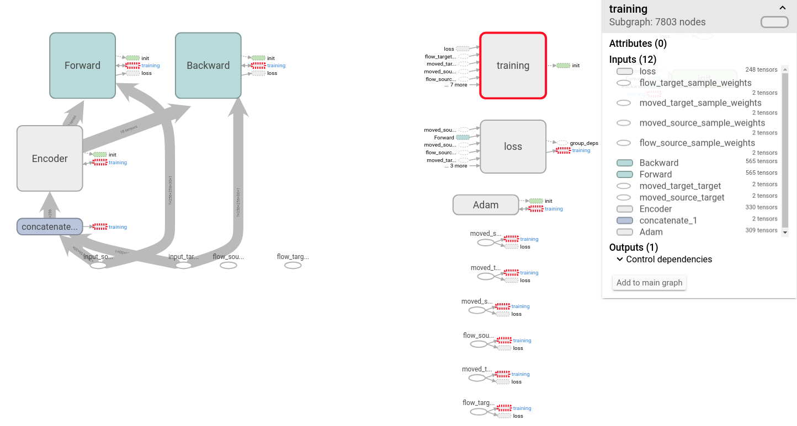

# An-Unsupervised-Learning-Bidirectional-3D-Image-Registration
The model contains 1 encoder and 2 decoders for bidirectional (source -> target, target -> source) 3D images registration with skip connections like Unet.
# How many GPUs do you need?
- You have to set at least 4 GPUs in config.py file
# Keras with Tensorflow backend
- Please intall it when you want to run.
- Don't forget to set your checkpoints and logs folders
# How to run?
- python train.py
- python test.py
# You can visualize your training process using Tensorboard
- tensorboard --logdir=/logs
# Acknowledgement
- This model is quite similar to Balakrishnan, Guha, et al. "An Unsupervised Learning Model for Deformable Medical Image Registration." arXiv preprint arXiv:1802.02604 (2018) paper.
# Note: You can only use it for research purposes.

  

